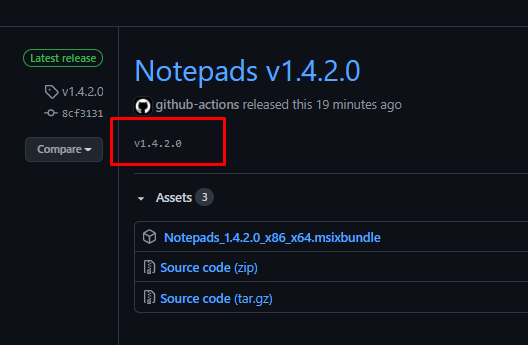
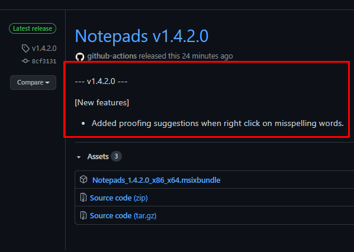

# Notepads CI/CD documentation

* after merging the PR, the first run of the "Notepads CI/CD Pipeline" workflow will not complete successfully, because it requires specific setup explained in this documentation. The two other workflows "CodeQL Analysis" and "Build", should complete successfully.

## 1. Set up SonarCloud
### SonarCloud is a cloud-based code quality and security service

#### Create SonarCloud project

- Go to https://sonarcloud.io/

- Click the "Log in" button and create a new account or connect with GitHub account (recommended)

- At the top right corner click the "+" sign

- From the dropdown select "Create new Organization"

- Click the "Choose an organization on GitHub" button

- Select an account for the organization setup

- On Repository Access select "Only select repositories" and select the project and click the "Save" button

- On the "Create organization page" don't change the Key and click "Continue"

- Select the Free plan then click the "Create Organization" button to finalize the creation of the Organization

#### Configure SonarCloud project

- At the top right corner click the "+" sign and select "Analyze new project"

- Select the project and click the "Set Up" button in the box on the right

- Under "Choose your analysis method" click "With GitHub Actions" and **keep the following page open**

- [Create a new PAT with **repo_deployment** and **read:packages** permissions](#6-how-to-create-a-pat) and copy the value of the generated token

- In the project's GitHub repository, go to the **Settings** tab -> Secrets 

- Click on **New Repository secret** and create a new secret with the name **SONAR_GITHUB_TOKEN** and the token you just copied as the value

- Create another secret with the two values from the SonarCloud page you kept open, which you can close after completing this step


- [Run the "Notepads CI/CD Pipeline" workflow manually](#2-run-workflow-manually) 

#### Set Quality Gate

- After the "Notepads CI/CD Pipeline" workflow has executed successfully, go to https://sonarcloud.io/projects and click on the project

- In the alert bar above the results, click the "Set new code definition" button and select "Previous version" (notice the "New Code definition has been updated" alert at the top)

- The Quality Gate will become active as soon as the next SonarCloud scan completes successfully

<br>

## 2. Run workflow manually

Once you've set up all the steps above correctly, you should be able to successfully complete a manual execution of the "Notepads CI/CD Pipeline" workflow.

  1. Go to the project's GitHub repository and click on the **Actions** tab

  2. From the "Workflows" list on the left, click on "Notepads CI/CD Pipeline"

  3. On the right, next to the "This workflow has a workflow_dispatch event trigger" label, click on the "Run workflow" dropdown, make sure the default branch is selected (if not manually changed, should be main or master) in the "Use workflow from" dropdown and click the "Run workflow" button


  4. Once the workflow run has completed successfully, move on to the next step of the documentation

NOTE: **screenshots are only exemplary**

<br>

## 3. Set up Dependabot

Dependabot is a GitHub native security tool that goes through the dependencies in the project and creates alerts, and PRs with updates when a new and/or non-vulnerable version is found.

- for PRs with version updates, this pipeline comes pre-configured for all current dependency sources in the project, so at "Insights" tab -> "Dependency graph" -> "Dependabot", you should be able to see all tracked sources of dependencies, when they have been checked last and view a full log of the last check


### Set up security alerts and updates
##### - GitHub, through Dependabot, also natively offers a security check for vulnerable dependencies

1. Go to "Settings" tab of the repo

2. Go to "Security & analysis" section

3. Click "Enable" for both "Dependabot alerts" and "Dependabot security updates"

- By enabling "Dependabot alerts", you would be notified for any vulnerable dependencies in the project. At "Security" tab -> "Dependabot alerts", you can manage all alerts. By clicking on an alert, you would be able to see a detailed explanation of the vulnerability and a viable solution.


- By enabling "Dependabot security updates", you authorize Dependabot to create PRs specifically for **security updates**


### Set up Dependency graph
##### - The "Dependency graph" option should be enabled by default for all public repos, but in case it isn't:

1. Go to "Settings" tab of the repo

2. Go to "Security&Analysis" section

3. Click "Enable" for the "Dependency graph" option

- this option enables the "Insights" tab -> "Dependency graph" section -> "Dependencies" tab, in which all the dependencies for the project are listed, under the different manifests they are included in


NOTE: **screenshots are only exemplary**

<br>

## 4. CodeQL

CodeQL is GitHub's own industry-leading semantic code analysis engine. CodeQL requires no setup, because it comes fully pre-configured by us. 

To activate it and see its results, only a push commit or a merge of a PR to the default branch of the repository, is required. 

We've also configured CodeQL to run on schedule, so every day at 8:00AM UTC, it automatically scans the code.

- you can see the results here at **Security** tab -> **Code scanning alerts** -> **CodeQL**:


- on the page of each result, you can see an explanation of what the problem is and also one or more solutions:


### Code scanning alerts bulk dismissal tool
##### - currently, GitHub allows for only 25 code scanning alerts to be dismissed at a time. Sometimes, you might have hundreds you would like to dismiss, so you will have to click many times and wait for a long time to dismiss them. Via the "csa-bulk-dismissal.yml", you would be able to that with one click.

NOTE: This tool executes manual **only**. It won't execute on any other GitHub event like push commit, PR creation etc.

#### 1. Setup

1. In the repository, go to the **Settings** tab -> **Secrets** 


2. Add the following secrets with the name and the corresponding value, by at the upper right of the section, clicking on the **New repository secret** button:


- CSA_ACCESS_TOKEN - [create a PAT with "security_events" permission only](#6-how-to-create-a-pat).

- DISMISS_REASON_VAR - this secret refers to the reason why you dismissed the code scanning alert. Use the appropriate one as the value of this secret, out of the three available options: **false positive**, **won't fix** or **used in tests**.

#### 2. Execution

1. In your repo, click on the Actions tab and on the left, in the Workflows list, click on the "Code scanning alerts bulk dismissal"


2. On the right, click on the "Run workflow" dropdown. Under "Use workflow from" choose your default branch (usually main/master) and click on the **Run workflow** button


3. If everything was set up currently in the "Setup" phase, the "Code scanning alerts bulk dismissal" workflow is going to be executed successfully, which after some time, would result in **all** previously open code scanning alerts, with a certain description be dismissed


NOTE: "closed" refers to "dismissed" alerts

#### 3. Customization

The "ALERT_DESC" strategy matrix in the pipeline, allows for more precise filtering of alerts to bulk dismiss. It uses the description of the alert to determine if it has to be dismissed or not. We've added the following alert descriptions by default:

- "Calls to unmanaged code"
- "Unmanaged code"

To add more descriptions, follow these steps:

1. In your source code, open ".github/workflows/csa-bulk-dismissal.yml"

2. On line 11, notice "ALERT_DESC: ['"Calls to unmanaged code"', '"Unmanaged code"']". This is the array of descriptions that the CSABD (Code scanning alerts bulk dismissal) tool uses to filter through the alerts:


3. To add more descriptions use comma separation, followed by a single space and the description enclosed in double quotes, then enclosed in single quotes:


<br>

## 5. Automated GitHub release

Automatically bumps up the GitHub tag in the repo, creates a GitHub release with the new tag and attaches the msixbundle to it

#### Setup

Add the following secrets by going to the repo **Settings** tab -> **Secrets**:

1. **GIT_USER_NAME** 
- used to add the identity required for creating a tag
- copy and paste your GitHub username as the value of the secret

2. **GIT_USER_EMAIL** 
- used to add the identity required for creating a tag 
- copy and paste your primary GitHub email as the value of the secret

3. **PFX_TO_BASE64**
- used to dynamically create the PFX file required for the signing of the **msixbundle**
- use the following PowerShell code locally to turn your PFX file into Base64:

```
# read from PFX as binary
$PFX_FILE = [IO.File]::ReadAllBytes('absolute_path_to_PFX')
# convert to Base64 and write in txt
[System.Convert]::ToBase64String($PFX_FILE) | Out-File 'absolute_path\cert.txt'
```

- copy the contents of the **cert.txt** and paste as the value of the secret

4. **PACKAGE_CERTIFICATE_PWD**
- used in the build of the project to authenticate the PFX
- copy and paste the password of your PFX as the value of this secret

NOTE: 
- none of those values are visible in the logs of the pipeline, nor are available to anyone outside of the original repository e.g. forks, anonymous clones etc.
- the dynamically created PFX file lives only for the duration of the pipeline execution

#### Execution

Follow these steps to trigger the automated GitHub release process:

1. Bump up the **Package.Identity.Version** in the **Package.appxmanifest**

2. Make a push commit to your master branch or if you've done the previous change in a feature branch, the merge of the PR to the master branch would act as the push commit

If the setup was done correctly and there are no errors in the pipeline, when the pipeline successfully completes, there should be a new, properly tagged GitHub release with the msixbundle attached to it.

NOTE: 
- the tag itself is used as the required description of the newly created tag, which appears here:



- it is replaced by the release description



<br>

## 6. How to create a PAT

- In a new tab open GitHub, at the top right corner, click on your profile picture and click on **Settings** from the dropdown.

	

- Go to Developer Settings -> Personal access tokens.

	

	

- Click the **Generate new token** button and enter password if prompted.

	

- Name the token, from the permissions list choose the ones needed and at the bottom click on the **Generate token** button.

	

- Copy the token value and paste it wherever its needed 

	

NOTE: once you close or refresh the page, you won't be able to copy the value of the PAT again!

#

Built with ❤ by [Pipeline Foundation](https://pipeline.foundation)
