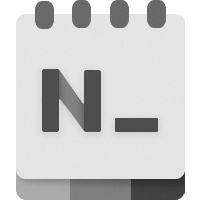

  

<h1 align="center">
  Notepads
</h1>

  A modern, lightweight text editor with minimum design.

  
  
  
  

## What is Notepads and why do I care?

I have waited long enough for a modern windows 10 notepad app to come before I have to do it myself. Don’t get me wrong, Notepad++, VS Code and Sublime are good text editors. I have used most of them and I will continue use them in the future. However, they are either too heavy or looks old. I really need a win32 notepad.exe replacement that feels light and looks cool to help me get things done as quickly as possible and use it as a turnaround text editor to quickly modify config files or write some notes. Most importantly, it has to be blazingly fast and beautiful. 

So here comes the “Notepads” 🎉 (s stands for Sets).

* Fluent design with built-in Tab system.
* Blazingly fast, feels like win32 notepad.exe but looks better.
* Launch from command line or PowerShell by typing: "notepads" or "notepads %path-to-your-file%".
* Multi-line handwriting support.
* Built-in Markdown file live preview.
* Built-in diff viewer (Preview your changes).

******* 📣 Notepads App is still under active development. *******

## Status update

[[08-12-2019] Status update and KPI report](https://github.com/JasonStein/Notepads/issues/138)

## Things are not working or not implemented in this version:

* File Print.

## Shortcuts:

* Ctrl+N/T to create new tab.
* Ctrl+(Shift)+Tab to switch between tabs.
* Ctrl+"+"/"-" to zoom font size. Ctrl+"0" to reset font size to default.
* Ctrl+L/R to change text flow direction. (LTR/RTL)
* Ctrl+P to toggle preivew split view for Markdown file.
* Alt+D to toggle side-by-side diff viewer.

## Author’s Notes:

The beta is intended to collect feedback, report bugs and glitches. For issue reporting and feature requests, please use [Github Issues](https://github.com/JasonStein/Notepads/issues). You can also join Notepads Discord server and chat with me directly: [Notepads Discord Server](https://discord.gg/VqetCub)

## Platform limitations (UWP):

* You won't be able to save files to system folders due to UWP restriction (windows, system32 etc.).
* You can not associate potentially harmful file types (.ps1, .bat, .xaml etc) with Notepads.
* If you drag a file into Notepads, file save picker will ask you to save it before closing due to UWP restriction.
* Notepads does not work well with large file, so I am setting the file size limit to 1MB for now. I will add large file support later.

## Downloads:

Please head over to [Github Releases](https://github.com/JasonStein/Notepads/releases) section to download latest release or get the latest version of Notepads in the [Microsoft Store](https://www.microsoft.com/store/apps/9nhl4nsc67wm).

## Roadmap:

* [Project Roadmap](ROADMAP.md)

## Changelog:

* [Notepads Releases](https://github.com/JasonStein/Notepads/releases)

## Disclaimer and Privacy statement:

To be 100% transparent, Notepads is not and will never collect user information in terms of user privacy. I might use analytics tools to collect usage data like how many times it has been downloaded or been used but that’s it. I will not track your IP or listen your typings or read any of your files and send it over to me, or third parties. Feel free to check the source code as well.

On the other hand, you might noticed that I work for Microsoft. However, Notepads is just my personal side project and I do it for fun and for good (To empower every person and every organization on the planet to achieve more😃). I do not work for Windows team, nor do I work for any Microsoft’s UX/App team. I am not expert on creating Windows apps either. I learned how to code UWP as soon as I started this project which is like only few weeks back. So don’t put too much hope on me or treat it as a project sponsored by Microsoft.

## Contributing:

* [How to contribute?](CONTRIBUTING.md)
* Notepads is free and open source, if you like my work, please consider:
   * Star this project on GitHub
   * Leave me a review [here](https://www.microsoft.com/store/apps/9nhl4nsc67wm)
   * 

## Dependencies and References:
* [Windows Community Toolkit](https://github.com/windows-toolkit/WindowsCommunityToolkit)
* [XAML Controls Gallery](https://github.com/microsoft/Xaml-Controls-Gallery)
* [Windows UI Library](https://github.com/Microsoft/microsoft-ui-xaml)
* [UICompositionAnimations](https://github.com/Sergio0694/UICompositionAnimations)
* [DiffPlex](https://github.com/mmanela/diffplex)

## Special Thanks:

* [Yi Zhou](http://zhouyiwork.com/) - App icon designer, Notepads App Icon is greatly inspired by the new icon for Windows Terminal.
* Alexandru Sterpu - App Tester, who helped me a lot during preview/beta testing.
* Code Contributors: [DanverZ](https://github.com/chenghanzou), [BernhardWebstudio](https://github.com/BernhardWebstudio), [Csányi István](https://github.com/AmionSky), [Pavel Erokhin](https://github.com/MairwunNx), [Sergio Pedri](https://github.com/Sergio0694)
* Localization Contributors: 
    * [fr-FR][French]: [François Rousselet](https://github.com/frousselet), [François-Joseph du Fou](https://github.com/FJduFou)
    * [es-ES][Spanish]: [Jose Pinilla](https://github.com/joseppinilla)
    * [zh-CN][Simplified Chinese]: [lindexi](https://github.com/lindexi), [walterlv](https://github.com/walterlv), [Jackie Liu](https://github.com/JasonStein)
    * [hu-HU][Hungarian]: [Csányi István](https://github.com/AmionSky)
    * [tr-TR][Turkish]: [Mert Demir](https://github.com/validatedev)
    * [ja-JP][Japanese]: [Mamoru Satoh](https://github.com/pnp0a03)
    * [de-DE][German]/[de-CH][German (Switzerland)]: [Walter Wolf](https://github.com/WalterWolf49)
    * [ru-RU][Russian]: [Pavel Erokhin](https://github.com/MairwunNx)
    * [fi-FI][Finnish]: [Esa Elo](https://github.com/sauihdik)
    * [uk-UA][Ukrainian]: [Taras Fomin aka Tarik02](https://github.com/Tarik02)
    * [it-IT][Italian]: [Andrea Guarinoni](https://github.com/guari)
    * [cs-CZ][Czech]: [Jan Rajnoha](https://github.com/JanRajnoha)
    * [pt-BR][Brazilian]: [Lucas Pinho B. Santos](https://github.com/pinholucas)

## Stay tuned 📢:

* [Original Reddit Post](https://www.reddit.com/r/Windows10/comments/btx5qs/my_design_implementation_of_modern_fluent_notepad/)
* [Notepads Discord Server](https://discord.gg/VqetCub)
