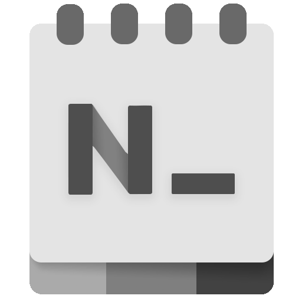

  

<h1 align="center">
  Notepads
</h1>

  A modern, lightweight text editor with a minimalist design.

  
  
  
  

## What is Notepads and why do I care?

I have been waiting long enough for a modern Windows 10 notepad app to come so I decide to create one myself. Don’t get me wrong, Notepad++, VS Code, and Sublime are great text editors. I have used them and I will continue to use them in the future. However, they are either too heavy or less interactive. I had a desire to replace a win32 notepad.exe with a software that was lightweight and looked impressive to get things done as quickly as possible (for example, as a turnaround text editor to quickly modify config files or write some notes). Most importantly, it had to be blazingly fast and appeal to everyone. 

So here comes the “Notepads” 🎉 (s stands for Sets).

* Fluent design with a built-in tab system.
* Blazingly fast and lightweight.
* Launch from the command line or PowerShell by typing: `notepads` or `notepads %FilePath%`.
* Multi-line handwriting support.
* Built-in Markdown live preview.
* Built-in diff viewer (preview your changes).
* Session snapshot and multi-instances.

******* 📣 Notepads App is still under active development. *******

## Status update

[[08-12-2019] Status update and KPI report](https://github.com/JasonStein/Notepads/issues/138)

## Shortcuts:

* Ctrl+N/T to create new tab.
* Ctrl+(Shift)+Tab to switch between tabs.
* Ctrl+Num(1-9) to quickly switch to specified tab.
* Ctrl+"+"/"-" to zoom font size. Ctrl+"0" to reset font size to default.
* Ctrl+L/R to change text flow direction. (LTR/RTL)
* Alt+P to toggle preview split view for Markdown file.
* Alt+D to toggle side-by-side diff viewer.

## Platform limitations (UWP):

* You won't be able to save files to system folders due to UWP restriction (windows, system32, etc.).
* You cannot associate potentially harmful file types (.ps1, .bat, .xaml, etc.) with Notepads.
* If you drag a file into Notepads, file save picker will ask you to save it before closing due to UWP restriction.
* Notepads does not work well with large files; the file size limit is set to 1MB for now. I will add large file support later.

## Downloads:

Please head over to the [Github Releases](https://github.com/JasonStein/Notepads/releases) section to download the latest release. You can also get the latest version of Notepads in the [Microsoft Store](https://www.microsoft.com/store/apps/9nhl4nsc67wm).

## Roadmap:

* [Project Roadmap](ROADMAP.md)

## Changelog:

* [Notepads Releases](https://github.com/JasonStein/Notepads/releases)

## Disclaimer and Privacy statement:

To be 100% transparent:

* Notepads does not and will never collect user information in terms of user privacy.
* I will not track your IP. 
* I will not record your typings or read any of your files created in Notepads including file name and file path. 
* No typings or files will be sent to me or third parties. 

I am using analytics service "AppCenter" to collect basic usage data plus some minimum telemetry to help me debug runtime errors. Here is the thread I made clear on this topic: https://github.com/JasonStein/Notepads/issues/334 

Feel free to review the source code or build your own version of Notepads since it is 100% open sourced.

You might notice that I work for Microsoft but Notepads is my personal project that I accomplish during free time (to empower every person and every organization on the planet to achieve more😃). I do not work for the Windows team, nor do I work for a Microsoft UX/App team. I am not expert on creating Windows apps either. I learned how to code UWP as soon as I started this project, so don’t put too much hope on me or treat it as a project sponsored by Microsoft.

## Contributing:

* [How to contribute?](CONTRIBUTING.md)
* Notepads is free and open source, if you like my work, please consider:
   * Star this project on GitHub
   * Leave me a review [here](https://www.microsoft.com/store/apps/9nhl4nsc67wm)
   * 

## Dependencies and References:
* [Windows Community Toolkit](https://github.com/windows-toolkit/WindowsCommunityToolkit)
* [XAML Controls Gallery](https://github.com/microsoft/Xaml-Controls-Gallery)
* [Windows UI Library](https://github.com/Microsoft/microsoft-ui-xaml)
* [UTF Unknown](https://github.com/CharsetDetector/UTF-unknown)
* [DiffPlex](https://github.com/mmanela/diffplex)

## Special Thanks:

* [Yi Zhou](http://zhouyiwork.com/) - App icon designer, Notepads App Icon is greatly inspired by the new icon for Windows Terminal.
* Alexandru Sterpu - App Tester, who helped me a lot during preview/beta testing.
* Code Contributors: [DanverZ](https://github.com/chenghanzou), [BernhardWebstudio](https://github.com/BernhardWebstudio), [Csányi István](https://github.com/AmionSky), [Pavel Erokhin](https://github.com/MairwunNx), [Sergio Pedri](https://github.com/Sergio0694), [Lucas Pinho B. Santos](https://github.com/pinholucas), [Soumya Ranjan Mahunt](https://github.com/soumyamahunt), [Belleve Invis](https://github.com/be5invis)
* Documentation Contributors: [Craig S.](https://github.com/sercraig)
* Localization Contributors: 
    * [fr-FR][French]: [François Rousselet](https://github.com/frousselet), [François-Joseph du Fou](https://github.com/FJduFou)
    * [es-ES][Spanish]: [Jose Pinilla](https://github.com/joseppinilla)
    * [zh-CN][Simplified Chinese]: [lindexi](https://github.com/lindexi), [walterlv](https://github.com/walterlv), [Jackie Liu](https://github.com/JasonStein)
    * [hu-HU][Hungarian]: [Csányi István](https://github.com/AmionSky)
    * [tr-TR][Turkish]: [Mert Can Demir](https://github.com/validatedev)
    * [ja-JP][Japanese]: [Mamoru Satoh](https://github.com/pnp0a03)
    * [de-DE][German]/[de-CH][German (Switzerland)]: [Walter Wolf](https://github.com/WalterWolf49)
    * [ru-RU][Russian]: [Pavel Erokhin](https://github.com/MairwunNx), [krlvm](https://github.com/krlvm)
    * [fi-FI][Finnish]: [Esa Elo](https://github.com/sauihdik)
    * [uk-UA][Ukrainian]: [Taras Fomin aka Tarik02](https://github.com/Tarik02)
    * [it-IT][Italian]: [Andrea Guarinoni](https://github.com/guari)
    * [cs-CZ][Czech]: [Jan Rajnoha](https://github.com/JanRajnoha)
    * [pt-BR][Brazilian]: [Lucas Pinho B. Santos](https://github.com/pinholucas)
    * [ko-KR][Korean]: [Donghyeok Tak](https://github.com/tdh8316)
    * [hi-IN][Hindi (India)]/[or-IN][Odia (India)]: [Soumya Ranjan Mahunt](https://github.com/soumyamahunt)
    * [pl-PL][Polish]: [Daxxxis](https://github.com/Daxxxis)
    * [ka-GE][Georgian (Georgia)]: [guram mazanashvili](https://github.com/gmaza)

## Stay tuned 📢:

* [Original Reddit Post](https://www.reddit.com/r/Windows10/comments/btx5qs/my_design_implementation_of_modern_fluent_notepad/)
* [Notepads Discord Server](https://discord.gg/VqetCub)
* [Notepads: Better Notepad! - YouTube Video made by Vasanth Developer](https://www.youtube.com/watch?v=7GXDrehNWb8)
